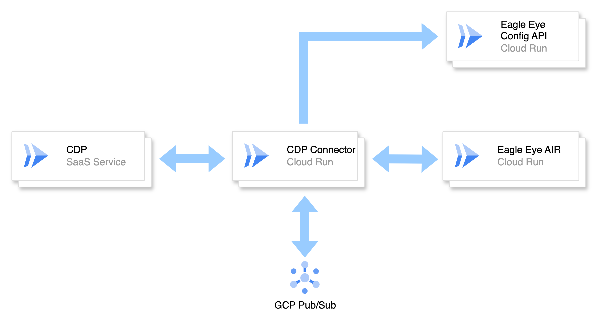
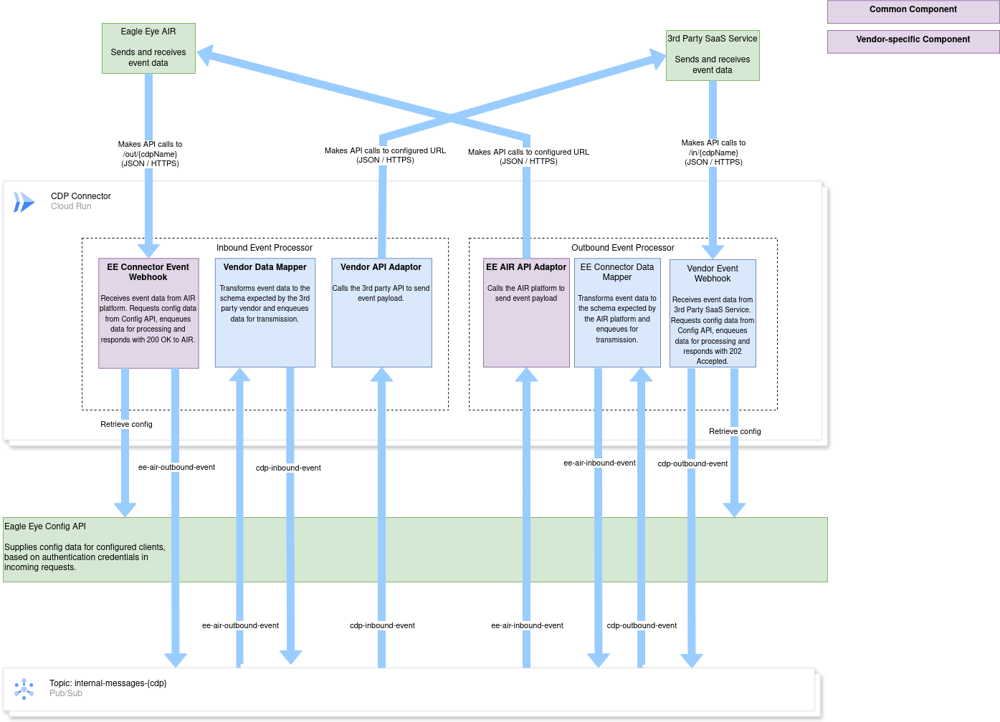
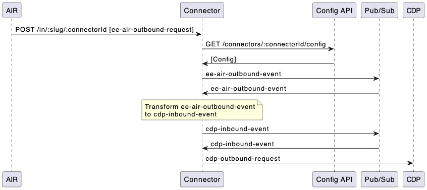
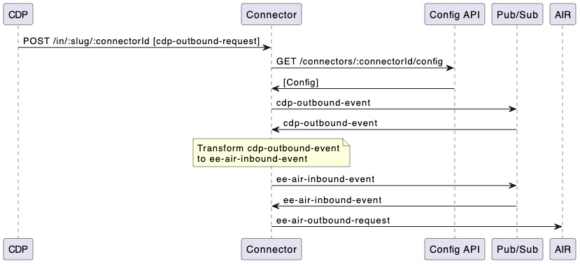

# Architecture

Connectors built using this framework act as intermediaries between the [Eagle Eye](https://eagleeye.com/) [AIR](https://eagleeye.com/air-platform) platform and a third-party Customer Data Platform (CDP). Within the Eagle Eye Connect environment, Connectors will additionally communicate with the Eagle Eye AIR Configuration Service to receive customer configuration data. The high-level architecture is shown in the diagram below:

The framework initially targets deployment to [GCP Cloud Run](https://cloud.google.com/run) and utilises [GCP Pub/Sub](https://cloud.google.com/pubsub) for asynchronous intra-process communications.

The Connector typically exposes the following APIs:

| Endpoint | Authentication Required | Purpose |
| -------- | ----------------------- | ------- |
| `/out/{platform}/status` | ❌ No | Healthcheck for outbound connections |
| `/out/{platform}/{connectorId}` | ✅ `X-Auth-Token` Header set to External Key | Receives outbound events from AIR, sends to the CDP |
| `/in/{platform}/status` |  ❌ No | Healthcheck for inbound connections |
| `/in/{platform}/{connectorId}` | ✅ `X-Auth-Token` Header set to External Key | Receives inbound events from the CDP, sends to AIR |
| `/internal/{platform}` | ✅ `Authorization` header set to JWT signed by Pub/Sub | Handles internal messages from GCP Pub/Sub |

## Component Diagram

## Glossary of Internal Message Types

| Internal Message Type   | Description                                                                                              |
| ----------------------- |--------------------------------------------------------------------------------------------------------- |
| `ee-air-outbound-event` | A message sent by Eagle Eye AIR to the Connector, to be transformed and delivered to the CDP.            |
| `cdp-inbound-event`     | A message created by the Connector to deliver data to the CDP, typically derived from an AIR event.      |
| `cdp-outbound-event`    | A message sent by the CDP to the Connector, to be transformed and delivered to Eagle Eye AIR.            |
| `ee-air-inbound-event`  | A message created by the Connector to deliver data to Eagle Eye AIR, typically derived from a CDP event. |

Each internal message type represents a distinct stage in the event lifecycle. The Connector is responsible for transforming and routing these messages between systems. Typically, `ee-air-outbound-event` is transformed into a `cdp-inbound-event`, and `cdp-outbound-event` is transformed into an `ee-air-inbound-event`.

## Sequence Charts

The following sequence charts illustrate the flow of data from AIR → CDP and CDP → AIR:

### AIR → CDP Message Sequence Chart

This chart illustrates how outbound events from AIR are received, transformed, and forwarded to the CDP.

### CDP → AIR Message Sequence Chart

This chart illustrates how outbound events from the CDP are received, transformed, and forwarded to Eagle Eye AIR.

